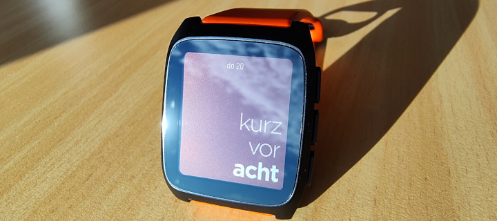
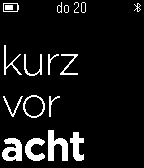
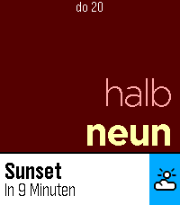
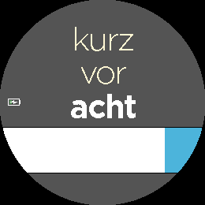
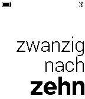

# kurz vor acht – German Pebble Watchface

This is is a watchface for the Pebble smartwatch that shows the current time in German.
The watchface is based on https://github.com/n3v3r001/n3v3rstextone by [@n3v3r001](https://github.com/n3v3r001) and the [fork](https://github.com/wolframroesler/Deutsch) by [@wolframroesler](https://github.com/wolframroesler) adjusted for modern pebbles while keeping compatibility with the originals.

The time is shown in colloquial, "fuzzy" mode: We say "kurz vor acht" ("just before eight") e.g. when it's 7:58, but an exact mode is also available.

Several color themes are available (selected with the configuration dialog in your phone's Pebble app).

## Screenshots

## Installation

### [Pebble Appstore](https://apps.repebble.com/4151feede8864a94905355d0)

### Sideloading
To install the watchface on your Pebble, download the latest release from the GitHub Releases page and upload the generated `kurz-vor-acht.pbw` file using the Pebble app on your smartphone. If you prefer building it yourself, you can also build and install the watchface with the [Pebble SDK](https://developer.repebble.com/sdk/). Also check out the devcontainer and GitHub Actions setup in this repo to see how to install the SDK and build the watchface.

Releases are built automatically in GitHub Actions, so the latest packaged build is always available from the repository's Releases page.

## Changes

In addition to the [changes](https://github.com/wolframroesler/Deutsch) by [@wolframroesler](https://github.com/wolframroesler) I have made these additions:

### Technical

* Update to Pebble SDK 4 to support Pebble 2, Pebble 2 Duo, Pebble Time 2 and Pebble Round 2
* Refactor layout logic to support an array of watch resolutions
* Recalculate the layout when Timeline events are obstructing the screen
* Added setup for DevContainer and GitHub Actions for automatic builds
* ~~Use GitHub Pages for the settings~~ Obsolete by move to Clay
* make the configuration page work in the cloudpebble and sdk emulator
* Update Configuration Page to use the clay library
* make bluetooth and battery icons work with color themes

### Layout

* On larger displays the text is padded to the bottom right with some margin to the screen borders
* Added configuration option for rectangle displays for text alignment
* Configuration options to for bluetooth and battery to only show when relevant

## Planned future changes

* Make it available in the Pebble store
    * New/Updated Screenshots, App-Icons, …
* fix three line text on flint with quick view
* make low battery threshold configurable
    * maybe even whether icon is displayed during charging
* Option to create custom theme with custom colours
* reduce options for incapable watches (e.g. colours for b/w watches)
* reuse same battery assets with pallette inversion instead of having separate resources
